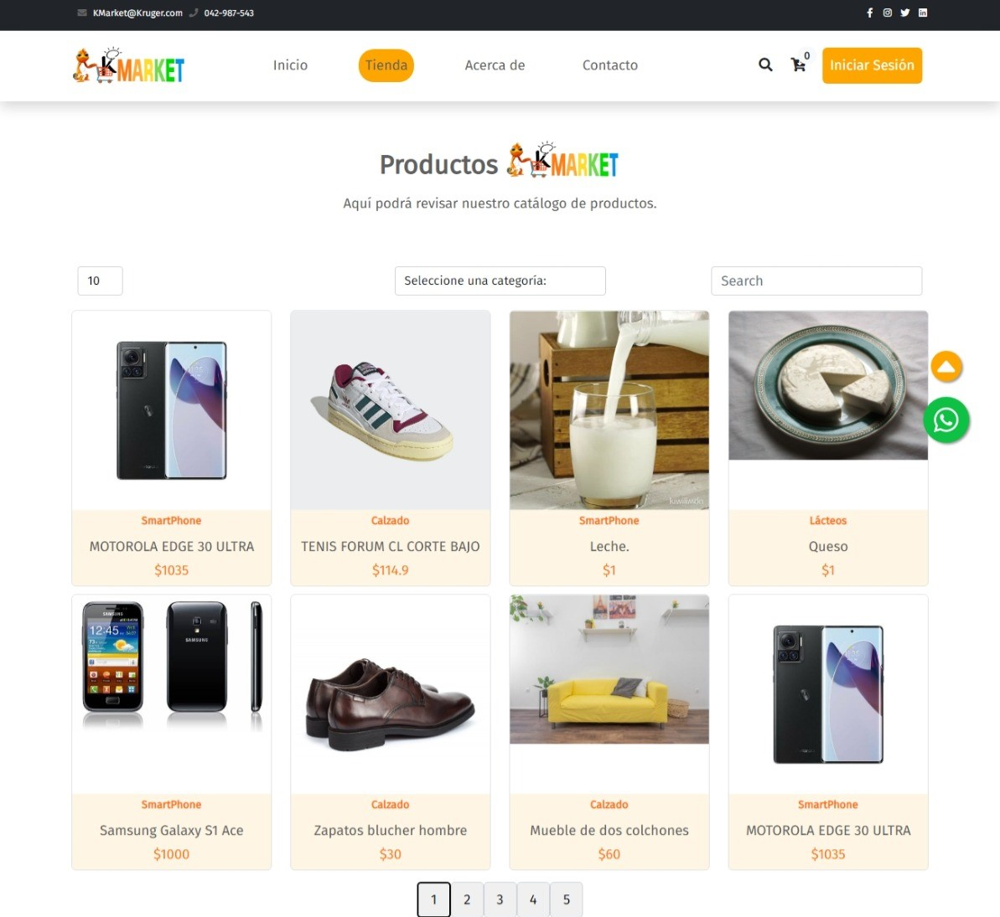

<h1 align="center"></h1>
<h1 align="center">🛒KMarket Ecommerce</h1>
<div align="center"></div>
<div align="center">
    
    
</div>
Un sitio web para un supermercado con funciones de agregar, modificar y eliminar productos junto a sus respectivas categorías. También es posible revisar más detalles sobre los productos y agregarlos al carrito de compras.
<details>
    <summary markdown="span"><strong>📖Tabla de contenidos</strong></summary>
<!-- markdownlint-disable MD051-->

- [🖥️Funciones](#🖥️funciones)
- [📃Requisitos](#📃requisitos)
- [🛠️Instalación](#🛠️instalación)
- [🎞️Capturas](#🎞️capturas)
- [💻Deploy](#💻deploy)
- [🤝Contacto](#🤝contacto)
- [🙏Agradecimientos](#🙏agradecimientos)
<!-- markdownlint-enable MD051-->
</details>

## 🖥️Funciones

<table>
    <tr><td><strong>Rápido</strong></td><td>La carga de los productos toma tan solo un segundo.</td></tr>
    <tr><td><strong>Escalable</strong></td><td>El rendimiento es óptimo sin importar cuánto incrementen las funciones de la página.</td></tr>
    <tr><td><strong>Productos</strong></td><td>Permite ingresar, modificar y eliminar productos.</td></tr>
    <tr><td><strong>Carrito</strong></td><td>Incluye un carrito de compras funcional.</td></tr>
    <tr><td><strong>Login</strong></td><td>Es posible iniciar sesión como usuario o admin y también permite registro.</td></tr>
</table>

## 📃Requisitos

- Node.js
- Java 17 o mayor
- Maven
- Git
- Un editor de código o IDE compatible con los lenguajes mencionados anteriormente.

## 🛠️Instalación

1. Descarga el código entero, o bien, ejecuta el siguiente comando en el directorio donde ubicarás el código:

    ```bash
    git clone `git@github.com:jeici21/biblioteca-libros.git`
    ```

2. Descarga y ejecuta los microservicios de este repositorio: [Back-end](https://github.com/LuisRAnrrango/E-Commerce-KrugerS.git).
3. Ejecuta este comando para instalar las dependencias necesarias:

    ```bash
    npm install
    ```

4. Usa este comando para ejecutar el proyecto:

    ```bash
    npm start
    ```

## 🎞️Capturas

<table>
    <tr>
        <th><p align="center">Página de inicio</p></th>
        <th><p align="center">Página de la tienda</p></th>
    </tr>
    <tr>
        <td rowspan="3"></td>
        <td></td>
    </tr>
    <tr>
        <th><p align="center">Página de inicio de sesión</p></th>
    </tr>
    <tr>
        <td></td>
    </tr>
</table>

## 💻Deploy

[Página desplegada](https://k-market-ten.vercel.app/)

## 🤝Contacto

- [Jorge Castro](https://github.com/jeici21)
- [Luis Anrrango](https://github.com/LuisRAnrrango)
- [Ariel Piguave](https://github.com/Piguave)

## 🙏Agradecimientos

- [José Gavilanes](https://github.com/joseandresgavilanes), por su inestimable ayuda embelleciendo la página web.
- [Kenan Al-jaber](https://github.com/KenanAljaber), por ayudarnos a resolver los problemas que teníamos en nuestros microservicios.
- [Ing. Juan Sotomayor](https://github.com/Juanse7793), por las clases de React que nos permitieron prepararnos para nuestro futuro profesional.
- [Ing. Jaime Sayago](https://github.com/jaimepsayago), por las enseñanzas de Spring Boot tan valiosas para volvernos desarrolladores full-stack.
