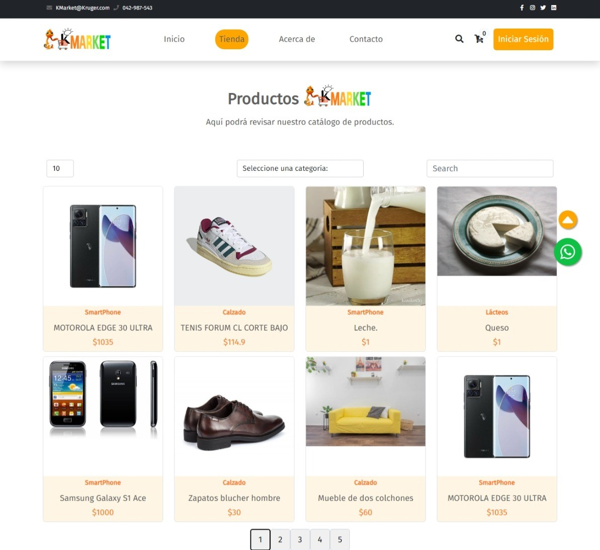

# KMarket Ecommerce

Un sitio web para un supermercado con funciones de agregar, modificar y eliminar productos junto a sus respectivas categorías. También es posible revisar más detalles sobre los productos y agregarlo a un carrito.

## Table de contenidos

- [Requisitos](#requisitos)
- [Instalación](#instalación)
- [Capturas](#capturas)
- [Desarrolladores](#desarrolladores)

## Requisitos

- Node.js 16 o mayor
- Java SDK 17 o mayor
- Maven 3 o mayor
- Un editor de código o IDE compatible con el proyecto.

## Instalación

1. Descarga el código entero, o bien, ejecuta el siguiente comando en el directorio donde ubicarás el código:

    ```bash
    git clone `git@github.com:jeici21/biblioteca-libros.git`
    ```

2. Descarga y ejecuta los microservicios de este repositorio: [Back-end](https://github.com/LuisRAnrrango/E-Commerce-KrugerS.git).
3. Ejecuta este comando para instalar las dependencias necesarias:

    ```bash
    npm install
    ```

4. Ejecuta el proyecto:

    ```bash
    npm start
    ```

## Capturas

<h3 style="text-align: center;">Página de inicio</h3>

<h3 style="text-align: center;">Página de la tienda</h3>

<h3 style="text-align: center;">Página de inicio de sesión</h3>


## Desarrolladores

- [Jorge Castro](https://github.com/jeici21)
- [Luis Anrrango](https://github.com/LuisRAnrrango)
- [Ariel Piguave](https://github.com/Piguave)
